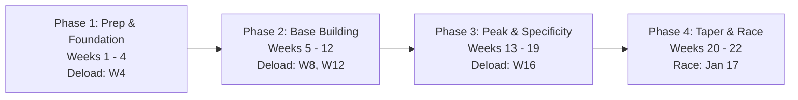
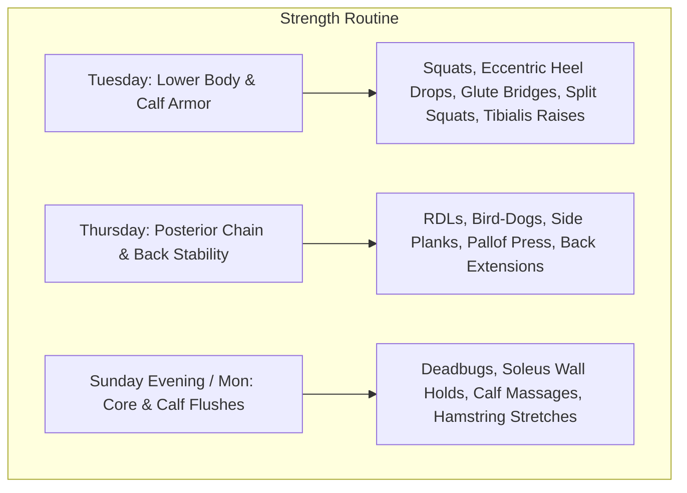

# ATHLETE PROFILE & MARATHON TRAINING CONTEXT

---

## 1. Executive Summary & Goal Definition

| Metric | Target / Specification |
| :--- | :--- |
| **Primary Goal Race** | **Tata Mumbai Marathon (TMM) 2027 — Full Marathon (42.195 km)** |
| **Primary Race Date** | **Sunday, January 17, 2027** |
| **Procam Slam Milestone 1** | **Vedanta Delhi Half Marathon (VDHM) — Sunday, October 18, 2026 (Week 9)** |
| **Procam Slam Milestone 2** | **Tata Steel World 25K Kolkata — Sunday, December 20, 2026 (Week 18)** |
| **Training Start Date** | **Monday, August 17, 2026** (Week 1 Kickoff) |
| **Total Duration** | **22 Weeks** (154 Days of structured training) |
| **Primary Goal** | **Sub-5:00:00 Marathon Finish at TMM** |
| **Target Marathon Pace** | **7:06 min/km** (11:26 min/mile) |
| **Procam Slam Strategy** | VDHM & Kolkata 25K are **non-tapered training runs** (subservient to TMM preparation). |
| **Current Baseline** | 10K in 60:00 (~6:00 min/km), Weekly Volume: 15–20 km |
| **Weekly Running Days** | **4 Days/Week** (Optionally 5 in select peak build weeks) |
| **Strength Training** | **3 Days/Week** (Targeting calves, glutes, lower back, core) |

---

## 2. Baseline Fitness & Performance Benchmarks

* **Recent Benchmark:** 10K completed in **60 minutes** (~6:00 min/km pace) approximately one month ago.
  * *Physiological Translation:* A 60:00 10K reflects an approximate VDOT of ~32–33, indicating that an aerobic ceiling for a sub-5:00:00 marathon (7:06 min/km) is well within physiological reach once aerobic endurance, muscular stamina, and fueling are developed.
* **Current Running Frequency & Volume:** 4 runs per week, averaging **15–20 km/week**, with the current longest run at **5 km**.
* **Training Continuity:** ~1 year of on-and-off running experience.
* **Current Comfortable Easy Pace:** **7:15 min/km**.
* **Tracking & Metrics:**
  * **Primary Tracking Devices:** Smartphone and **Samsung Galaxy Watch 4**.
  * **Core Metrics:** Pacing ($\text{min/km}$) and Rate of Perceived Exertion (**RPE**, 1–10 scale). Heart Rate data is currently uncalibrated and will serve as secondary observation.

---

## 3. Targeted Pace Zones & Training Intensity (Sub-5:00 Marathon)

Based on a **5:00:00 finish (7:06 min/km)** and a **60:00 10K baseline**, training will be governed by the following calculated zones:

| Training Zone | Pace Range ($\text{min/km}$) | RPE (1–10) | Primary Purpose & Physiology |
| :--- | :--- | :---: | :--- |
| **Recovery / Easy Pace** | **7:30 – 8:00** | $2 - 3$ | Active recovery, vascularization, capillary growth, fat oxidation. |
| **Marathon Goal Pace (MP)** | **7:00 – 7:06** | $4 - 5$ | Race-specific economy, neuromuscular rhythm, glycogen efficiency. |
| **Aerobic Threshold / Long Run** | **7:15 – 7:45** | $3 - 4$ | Building mitochondria, mental stamina, time on feet. |
| **Lactate Threshold / Tempo** | **6:15 – 6:35** | $6 - 7$ | Clearing blood lactate, raising sustainable speed. |
| **Interval / 10K Pace** | **5:45 – 6:00** | $7 - 8$ | $\text{VO}_2\text{max}$ enhancement, running form, cardiac stroke volume. |
| **Hill Repeats / Strides** | Fast / Controlled | $8 - 9$ | Power development, calf & Achilles tendon stiffness, stride power. |

---

## 4. Course & Environmental Intelligence

### A. Tata Mumbai Marathon (TMM) Course Profile
* **Start & Finish:** Chhatrapati Shivaji Maharaj Terminus (CSMT) / Azad Maidan (~5:00 AM start).
* **Course Highlights:**
  * **Marine Drive & Chowpatty (km 0–8 & km 37–42):** Flat, open tarmac subject to coastal winds and morning sun exposure on the return leg.
  * **Pedder Road Flyover / Hill #1 (km ~10–12):** Early uphill gradient testing discipline; must avoid surging.
  * **Bandra-Worli Sea Link (km ~14–20 & km ~24–30):** Scenic, long, flat stretches over water; crosswinds and slight expansion joint elevations.
  * **Pedder Road / Jaslok Hospital Incline #2 (km ~35–37):** **The decisive climb of the race.** Occurs exactly when glycogen is low and muscular fatigue is peak. The training plan will incorporate specific hill workouts to simulate this late-race test.

### B. Environmental Differential: Bengaluru vs. Mumbai
* **Training Ground (Bengaluru):**
  * Elevation: $\sim 920\text{ m}$ above sea level (mild altitude conditioning benefit).
  * Climate: $18^\circ\text{C} - 26^\circ\text{C}$, relatively lower humidity, cool mornings.
* **Race Day (Mumbai):**
  * Elevation: Sea level (slight positive oxygen density effect).
  * Climate: Warm & humid ($20^\circ\text{C} - 30^\circ\text{C}$, $65\% - 85\%$ humidity). Radiant heat sets in rapidly after 7:30 AM.
* **Strategic Adjustment:** High sweat rates in Mumbai make **sodium depletion** the primary risk for cramping. Heat acclimatization in later stages and aggressive hydration/electrolyte testing during training are mandatory.

---

## 5. Critical Biomechanical & Injury Risk Management

### Issue 1: Severe Calf Cramping at km 18–19 (Priority #1)
* **Root Causes:**
  1. **Neuromuscular Fatigue:** Under-conditioned calf muscles (gastrocnemius & soleus) failing under sustained eccentric loading beyond current volume thresholds.
  2. **Electrolyte/Sodium Depletion:** Heavy sweat rates causing rapid electrolyte imbalance.
* **Countermeasures:**
  * **Targeted Strength Work:** Eccentric heel drops, seated/standing calf raises, and tibialis anterior raises 3x/week.
  * **Electrolyte & Salt Strategy:** Introduction of salt capsules (e.g., Fast&Up Reload, SaltStick) taken every 45–60 mins alongside water/gels during long runs.
  * **Pacing Discipline:** Enforcing strictly conservative long run pacing ($7:30 - 7:45\text{ min/km}$) to prevent early muscular fatigue.

### Issue 2: Lower Back Pain & Historical Knee Issues
* **Root Causes:** Glute amnesia, weak deep core stabilizers (transverse abdominis), tight hip flexors/hamstrings shifting load into the lumbar spine during long upright running.
* **Countermeasures:**
  * Core and posterior chain stabilization: Bird-dogs, side planks, glute bridges, Romanian deadlifts (RDLs), and hip mobility drills.
  * Step cadence optimization ($\sim 165 - 175\text{ spm}$) to reduce ground reaction force through the knee joint.

### Issue 3: History of Overuse Niggles (Plantar Fasciitis, Shin Splints, ITBS, Achilles)
* **Mitigation:** Strict 10% rule on weekly volume progression; scheduled deload weeks every 4th week; proper warm-up dynamic drills and post-run soft tissue release.

---

## 6. Weekly Schedule Architecture

All running sessions will be completed in the **morning**.

| Day | Session Type | Objective & Pacing | Supporting Activity |
| :--- | :--- | :--- | :--- |
| **Monday** | **Short Recovery Run** | 4 – 7 km @ Easy/Recovery Pace ($7:40 - 8:00\text{ min/km}$) | Post-run Lower Back & Core Mobility |
| **Tuesday** | **Strength Day 1** | *No Running* (Full focus on Lower Body: Glutes, Hamstrings, Calves) | Foam Rolling & Hip Openers |
| **Wednesday** | **Mid-Week Aerobic Run** | 6 – 12 km @ Easy / Aerobic Pace ($7:15 - 7:35\text{ min/km}$) | Dynamic Mobility |
| **Thursday** | **Strength Day 2** | *No Running* (Core, Posterior Chain, Back Stability, Upper Body) | Mobility Work |
| **Friday** | **Quality / Speed Session** | 6 – 11 km total (Rotating: Hill Repeats, Tempo, or Intervals) | Lower leg stretches & warm-up drills |
| **Saturday** | **Full Rest Day** | **Complete Rest & Carb/Hydration Prep** | Light walking / stretching only |
| **Sunday** | **Long Run (LR)** | 8 – 32 km progressive @ Long Run Pace ($7:30 - 7:45\text{ min/km}$) | Fueling trial & post-run recovery |

*Note on 5th Day:* In specific peak build weeks (Weeks 15, 17, 19), an optional light 4–5 km easy jog or recovery walk may be added on Thursday mornings if feeling fully recovered.

---

## 7. Periodization Structure (22 Weeks)

The plan follows a 4-stage periodization model with built-in **deload weeks every 4 weeks** (volume reduced by $\sim 25 - 30\%$):

1. **Phase 1: Prep & Musculoskeletal Foundation (Weeks 1 – 4 | 20 km $\rightarrow$ 28 km)**
   * *Focus:* Adapting tendons, establishing the 4-day rhythm, introducing 3x/week strength routine, solving calf stiffness.
   * *Deload:* **Week 4**
2. **Phase 2: Aerobic Base Building (Weeks 5 – 12 | 28 km $\rightarrow$ 42 km)**
   * *Focus:* Expanding capillary beds, extending Sunday long runs from 12 km to 22 km (breaking the 18–19 km cramping threshold safely), incorporating steady hill repeats for Pedder Road simulation.
   * *Deloads:* **Week 8 & Week 12**
   * *Milestone:* 10K Time Trial in Week 8.
3. **Phase 3: Peak & Race Specificity (Weeks 13 – 19 | 42 km $\rightarrow$ 56 km)**
   * *Focus:* Peak volume, back-to-back fatigue resistance, long runs reaching 25 km, 28 km, and a maximum of 32 km. Full dress rehearsal of nutrition, hydration vest, and shoes.
   * *Deload:* **Week 16**
   * *Milestone:* Half Marathon Simulation Race in Week 14.
4. **Phase 4: Taper & Race Execution (Weeks 20 – 22 | 56 km $\rightarrow$ Race)**
   * *Focus:* Glycogen replenishment, cellular repair, maintaining leg turnover with short MP strides, travel logistics to Mumbai, race morning pacing discipline.

---

## 8. Strength & Conditioning Architecture (3 Days / Week)

Designed specifically to eradicate calf cramps, lower back strain, and knee pain without interfering with Friday speed or Sunday long runs.

### Day 1 (Tuesday): Lower Body & Calf Armor
1. **Single-Leg Eccentric Heel Drops (on a step):** $3 \times 15$ reps/leg (3-second slow descent) — *Essential for Achilles & calf stamina.*
2. **Seated Bent-Knee Calf Raises (Soleus target):** $3 \times 15$ reps.
3. **Bulgarian Split Squats / Reverse Lunges:** $3 \times 8 - 10$ reps/leg (Knee stability & quad strength).
4. **Single-Leg Glute Bridges:** $3 \times 12$ reps/leg (Glute activation to protect lower back).
5. **Tibialis Anterior Wall Raises:** $3 \times 20$ reps (Shin splint prevention).

### Day 2 (Thursday): Posterior Chain, Core & Lumbar Support
1. **Dumbbell / Resistance Band Romanian Deadlifts (RDLs):** $3 \times 10$ reps (Hamstring & lower back resilience).
2. **Bird-Dogs (with 3-sec pause):** $3 \times 10$ reps/side (Lumbar spine stabilization).
3. **Side Planks & Front Planks:** $3 \times 30 - 45$ seconds.
4. **Pallof Press (Anti-rotation):** $3 \times 12$ reps/side.
5. **Superman / Back Extensions:** $3 \times 12$ reps.

### Day 3 (Saturday or Post-Run Monday): Functional Core & Hip Prehab
* Deadbugs, Clamshells, Monster band walks, and Cat-Cow stretches.

---

## 9. Fueling, Hydration & Gear Strategy

* **Shoes:** **Adidas Adizero Evo SL 2** (All-in-one daily trainer, speed shoe, and race shoe).
  * *Strategy:* Monitor wear; ensure shoe has between 150–350 km of mileage by race day (broken in, but optimal cushion retained).
* **Hydration Gear:** Hydration vest with front soft flasks.
* **On-Run Fueling Strategy:**
  * **Energy Gels:** Practice taking 1 gel every **40–45 minutes** on all long runs exceeding 75 minutes ($30 - 45\text{g}$ carbs/hour).
  * **Electrolytes & Salt Tablets:** Start integrating electrolyte powders (e.g., Fast&Up Reload) or salt capsules into hydration vest water starting from Week 3. Aim for $400 - 600\text{ mg}$ sodium per hour to counter Mumbai's humidity and prevent calf cramping.
  * **Fluid Intake:** $150 - 200\text{ ml}$ small sips every 15–20 minutes.
* **Sleep & Recovery:** Maintain baseline **7–8 hours** of sleep; emphasize post-long-run carbohydrate and protein replenishment within 45 minutes of finishing.

---

*This document serves as the master blueprint for generating and adjusting the week-by-week 22-week training schedule.*
