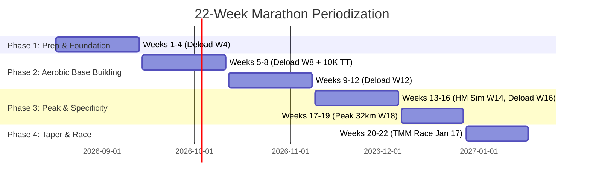
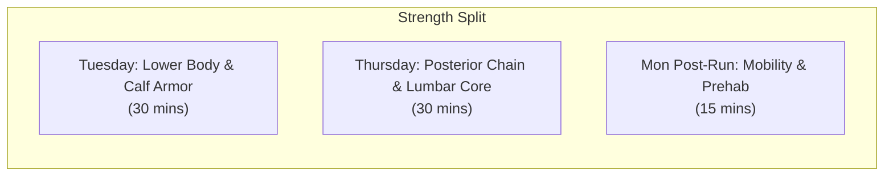

# 22-WEEK SUB-5:00 MARATHON MASTER PLAN
### Target Race: Tata Mumbai Marathon (TMM) — Sunday, January 17, 2027
**Target Finish Time:** 4:59:59 (Goal Pace: **7:06 min/km** / 11:26 min/mile)  
**Training Start Date:** Monday, August 17, 2026 (Kickoff Week 1)  
**Training Base:** Bengaluru, India | **Race Location:** Mumbai, India  

---

## 1. Master Mileage & Phase Progression Overview



### Weekly Mileage Progression Curve

| Week | Phase | Dates | Target Distance | Long Run (Sun) | Deload / Test | Primary Weekly Focus |
| :---: | :---: | :---: | :---: | :---: | :---: | :--- |
| **0** | Ramp-Up | Aug 12 – Aug 16 | 11 km | 6 km | — | Active ramp-up to Monday kickoff |
| **1** | **Prep** | Aug 17 – Aug 23 | **21 km** | **7 km** | — | Establishing 4-day rhythm & calf strength |
| **2** | **Prep** | Aug 24 – Aug 30 | **24 km** | **8 km** | — | Introducing hill form & tempo strides |
| **3** | **Prep** | Aug 31 – Sep 06 | **27 km** | **10 km** | — | First double-digit long run + hydration test |
| **4** | **Prep** | Sep 07 – Sep 13 | **20 km** | **7 km** | **DELOAD 1** | Neuromuscular recovery & soft-tissue adaptation |
| **5** | **Base** | Sep 14 – Sep 20 | **29 km** | **12 km** | — | Aerobic base expansion; introducing 800m reps |
| **6** | **Base** | Sep 21 – Sep 27 | **33 km** | **14 km** | — | Pedder Road hill simulation workout #1 |
| **7** | **Base** | Sep 28 – Oct 04 | **37 km** | **16 km** | — | Long run nutrition & electrolyte test ($400\text{mg Na/hr}$) |
| **8** | **Base** | Oct 05 – Oct 11 | **26 km** | **10 km** | **DELOAD 2 (10K TT)** | **Mid-Base 10K Time Trial** (Aim: Sub-59 min) |
| **9** | **Base** | Oct 12 – Oct 18 | **41 km** | **21.1 km** | **PROCAM SLAM #1** | **VDHM 2026 (Delhi Half Marathon)** — Steady Training Run |
| **10** | **Base** | Oct 19 – Oct 25 | **42 km** | **20 km** | — | **Breaking the 20K mark** @ 7:35–7:45 min/km |
| **11** | **Base** | Oct 26 – Nov 01 | **45 km** | **22 km** | — | Sustained aerobic volume + tempo segments |
| **12** | **Base** | Nov 02 – Nov 08 | **32 km** | **14 km** | **DELOAD 3** | Mid-program reset & musculoskeletal check |
| **13** | **Peak** | Nov 09 – Nov 15 | **46 km** | **24 km** | — | Peak phase opening; Marathon Pace blocks |
| **14** | **Peak** | Nov 16 – Nov 22 | **40 km** | **21.1 km** | **HM SIMULATION** | **Half Marathon Race Simulation** (Aim: ~2:15–2:20) |
| **15** | **Peak** | Nov 23 – Nov 29 | **50 km** | **26 km** | — | High volume week; hydration vest dress rehearsal |
| **16** | **Peak** | Nov 30 – Dec 06 | **36 km** | **16 km** | **DELOAD 4** | Pre-peak rest & glycogen store refresh |
| **17** | **Peak** | Dec 07 – Dec 13 | **55 km** | **30 km** | **BIG DISTANCE** | **30 km Volume Builder** (Fatigue resistance) |
| **18** | **Peak** | Dec 14 – Dec 20 | **49 km** | **25.0 km** | **PROCAM SLAM #2** | **KOLKATA 25K (TSW 25K)** — MP Race Simulation |
| **19** | **Peak** | Dec 21 – Dec 27 | **46 km** | **24 km** | — | Post-peak consolidation run |
| **20** | **Taper** | Dec 28 – Jan 03 | **35 km** | **18 km** | **TAPER 1** | Volume drop $-35\%$, intensity preserved |
| **21** | **Taper** | Jan 04 – Jan 10 | **26 km** | **12 km** | **TAPER 2** | Volume drop $-55\%$, short MP sharpener |
| **22** | **Race** | Jan 11 – Jan 17 | **54.2 km** | **42.2 km** | **PROCAM SLAM #3** | **TATA MUMBAI MARATHON (Sub-5:00:00 Target!)** 🏆 |

---

## 2. Pace & Effort Master Reference Chart

| Run Type | Target Pace ($\text{min/km}$) | Target RPE ($1-10$) | Breathing & Sensation |
| :--- | :---: | :---: | :--- |
| **Short Recovery Run (Mon)** | **7:45 – 8:15** | $2 / 10$ | Very light, full sentences, effortless breathing |
| **Mid-Week Aerobic Run (Wed)** | **7:15 – 7:35** | $3 / 10$ | Conversational, smooth cruising, aerobic building |
| **Marathon Goal Pace - MP (Sun blocks)** | **7:00 – 7:06** | $4 - 5 / 10$ | Controlled, sustainable, dialed-in rhythm |
| **Tempo / Threshold (Fri)** | **6:15 – 6:35** | $6 - 7 / 10$ | "Comfortably hard", 2-3 word sentences |
| **Intervals / 10K Pace (Fri)** | **5:45 – 6:00** | $7 - 8 / 10$ | Fast, powerful stride, deep rhythmic breathing |
| **Long Run Steady (Sun)** | **7:30 – 7:45** | $3 - 4 / 10$ | Relaxed, fat-burning zone, protecting calves |

---

## 3. Dedicated Strength & Prehab Protocol (3 Days / Week)



### Tuesday: Lower Body & Calf Armor (30–35 Mins)
1. **Single-Leg Eccentric Heel Drops (on a step):** $3 \times 15$ reps per leg. (Lower down over 3 seconds, rise on both). *Targets Achilles & Gastrocnemius.*
2. **Seated Bent-Knee Calf Raises (with weight/backpack on knees):** $3 \times 15$ reps. *Isolates Soleus muscle—critical for preventing late-race cramps.*
3. **Tibialis Anterior Wall Raises:** $3 \times 20$ reps. (Lean back against a wall, lift toes up). *Prevents shin splints.*
4. **Bulgarian Split Squats / Reverse Lunges:** $3 \times 8 - 10$ reps per leg. *Knee stability and quad control.*
5. **Single-Leg Glute Bridges:** $3 \times 12$ reps per leg with 2-second hold at the top. *Protects lower back.*

### Thursday: Posterior Chain, Back & Core Stability (30 Mins)
1. **Dumbbell / Resistance Band Romanian Deadlifts (RDLs):** $3 \times 10$ reps. *Strengthens hamstrings & lumbar spine.*
2. **Bird-Dogs with 3-Second Hold:** $3 \times 10$ reps per side. *Deep transverse abdominis & multifidus stability.*
3. **Side Planks:** $3 \times 35 - 45$ seconds per side. *Quadratus lumborum & obliques for upright posture.*
4. **Deadbugs:** $3 \times 12$ reps alternating. *Anti-extension core strength to stop lower back arching.*
5. **Prone Cobras / Supermans:** $3 \times 12$ reps. *Upper and lower back endurance.*

### Monday Post-Run: 15-Minute Hip & Calf Flush
* Foam roll calves, IT band, and quads (30 sec/muscle).
* Pigeon Pose & Couch Stretch (hip flexors) for 60 seconds per side.
* Cat-Cow stretch (10 slow breaths).

---

## 4. On-Course Fueling & Anti-Cramp Hydration Protocol

| Distance / Time | Water / Fluid Intake | Fuel (Energy Gel) | Sodium / Electrolyte Protocol |
| :--- | :--- | :--- | :--- |
| **0 – 40 mins (0–5 km)** | $150\text{ ml}$ water sips every 15 min | None needed | Pre-run: $250\text{ ml}$ water with 1 salt capsule |
| **40 – 45 mins (~6 km)** | $150\text{ ml}$ water sips | **Gel #1** with $150\text{ ml}$ plain water | 1 Salt capsule / chew ($200\text{mg}$ sodium) |
| **80 – 90 mins (~12 km)** | $150\text{ ml}$ water sips | **Gel #2** with $150\text{ ml}$ plain water | 1 Salt capsule / chew ($200\text{mg}$ sodium) |
| **120 – 130 mins (~17–18 km)** | $150\text{ ml}$ water sips | **Gel #3** with $150\text{ ml}$ plain water | **CRITICAL: 1 Salt capsule** (Before cramp zone) |
| **160 – 170 mins (~23–24 km)** | $150\text{ ml}$ water sips | **Gel #4** with $150\text{ ml}$ plain water | 1 Salt capsule / chew ($200\text{mg}$ sodium) |
| **200 – 210 mins (~29–30 km)** | $150\text{ ml}$ water sips | **Gel #5** with $150\text{ ml}$ plain water | 1 Salt capsule / chew ($200\text{mg}$ sodium) |
| **240 – 250 mins (~35 km - Pedder Rd)** | $150\text{ ml}$ water sips | **Gel #6 (Caffeine optional)** | 1 Salt capsule before the climb |

> [!IMPORTANT]
> **Golden Rule for Cramp Prevention:** Always take energy gels with plain water (not concentrated sports drinks) to avoid gastric distress. Take your salt capsule with water at least **15–20 minutes before** your previous cramp threshold (i.e. at km 15–16).

---

## 5. Detailed Week-by-Week & Day-by-Day Training Schedule

### Pre-Kickoff: Week 0 (Aug 12 – Aug 16, 2026) — Onboarding & Ramp-Up
* **Wed (Aug 12):** 4 km Easy Shakeout Run @ 7:45 min/km.
* **Thu (Aug 13):** Intro Strength (Core & Lower Back Routine - 20 mins).
* **Fri (Aug 14):** 4 km Easy Run + $4 \times 20$-sec Strides on flat road.
* **Sat (Aug 15):** Full Rest Day.
* **Sun (Aug 16):** 6 km Easy Long Run @ 7:35–7:45 min/km. Hydration vest check.

---

### PHASE 1: PREP & FOUNDATION (Weeks 1 – 4)
*Objective: Establish the 4-day running habit, build calf and back resilience, adapt tendons.*

#### Week 1 (Aug 17 – Aug 23, 2026) — Total Volume: 21 km
* **Mon (Aug 17):** 4 km Short Recovery Run @ 7:50–8:10 min/km (RPE 2). Post-run calf stretches.
* **Tue (Aug 18):** **Strength Day 1:** Lower Body & Calf Armor (Eccentric heel drops, soleus raises, glute bridges).
* **Wed (Aug 19):** 5 km Mid-Week Aerobic Run @ 7:20–7:35 min/km (RPE 3).
* **Thu (Aug 20):** **Strength Day 2:** Posterior Chain & Lumbar Core (RDLs, Bird-dogs, Side planks).
* **Fri (Aug 21):** **Speed Session (Strides):** 5 km Total — 1.5 km warmup @ 7:45, then $5 \times 100\text{m}$ fast relaxed strides (accelerate smoothly to ~5:30 min/km with 90s walk recovery), 2 km cooldown @ 7:45.
* **Sat (Aug 22):** Full Rest Day. Hydrate well.
* **Sun (Aug 23):** **Long Run: 7 km** @ 7:35–7:45 min/km (RPE 3-4). Practice taking small sips of water every 2 km.

#### Week 2 (Aug 24 – Aug 30, 2026) — Total Volume: 24 km
* **Mon (Aug 24):** 4.5 km Short Recovery Run @ 7:50–8:10 min/km.
* **Tue (Aug 25):** **Strength Day 1:** Lower Body & Calf Armor.
* **Wed (Aug 26):** 5.5 km Mid-Week Aerobic Run @ 7:15–7:30 min/km.
* **Thu (Aug 27):** **Strength Day 2:** Posterior Chain & Core.
* **Fri (Aug 28):** **Speed Session (Hill Intro):** 6 km Total — 2 km warmup @ 7:45, $4 \times 60$-sec steady uphill repeats (focus on upright posture, high knees, light cadence, jog down recovery), 2 km cooldown @ 7:45.
* **Sat (Aug 29):** Full Rest Day.
* **Sun (Aug 30):** **Long Run: 8 km** @ 7:30–7:45 min/km. Test taking 1st Energy Gel at 45 min mark with water.

#### Week 3 (Aug 31 – Sep 06, 2026) — Total Volume: 27 km
* **Mon (Aug 31):** 5 km Short Recovery Run @ 7:50–8:10 min/km.
* **Tue (Sep 01):** **Strength Day 1:** Lower Body & Calf Armor (Add 2.5 kg weight to heel drops if comfortable).
* **Wed (Sep 02):** 6 km Mid-Week Aerobic Run @ 7:15–7:30 min/km.
* **Thu (Sep 03):** **Strength Day 2:** Posterior Chain & Core.
* **Fri (Sep 04):** **Speed Session (Tempo Intro):** 6 km Total — 1.5 km warmup, $3 \times 1\text{ km}$ @ Tempo Pace (6:30 min/km) with 2 min walking rest between, 1.5 km cooldown.
* **Sat (Sep 05):** Full Rest Day.
* **Sun (Sep 06):** **Long Run: 10 km** @ 7:30–7:45 min/km. 1st double-digit run. Take 1 Gel at km 6 + 1 Salt capsule at km 5.

#### Week 4 (Sep 07 – Sep 13, 2026) — Total Volume: 20 km [DELOAD WEEK 1]
* **Mon (Sep 07):** 4 km Short Recovery Run @ 8:00 min/km (Super easy).
* **Tue (Sep 08):** **Strength Day 1:** Light mobility & bodyweight calf raises ($2 \times 12$).
* **Wed (Sep 09):** 5 km Mid-Week Aerobic Run @ 7:25–7:40 min/km.
* **Thu (Sep 10):** **Strength Day 2:** Core & Back Stability (Light bird-dogs & planks).
* **Fri (Sep 11):** **Speed Session (Form & Strides):** 4 km Total — 2 km easy, $4 \times 100\text{m}$ relaxed strides, 1.5 km easy.
* **Sat (Sep 12):** Full Rest Day. Sleep 8+ hours.
* **Sun (Sep 13):** **Long Run: 7 km** @ 7:40–7:50 min/km. Effortless cruise.

---

### PHASE 2: AEROBIC BASE BUILDING (Weeks 5 – 12)
*Objective: Build capillary density, expand mitochondrial volume, tackle the 18–20 km cramp zone safely.*

#### Week 5 (Sep 14 – Sep 20, 2026) — Total Volume: 29 km
* **Mon (Sep 14):** 5 km Recovery Run @ 7:50 min/km.
* **Tue (Sep 15):** **Strength Day 1:** Lower Body & Calf Armor.
* **Wed (Sep 16):** 6 km Aerobic Run @ 7:15–7:30 min/km.
* **Thu (Sep 17):** **Strength Day 2:** Posterior Chain & Core.
* **Fri (Sep 18):** **Speed Session (Intervals):** 6 km Total — 1.5 km warmup, $4 \times 400\text{m}$ @ 5:50 min/km (200m jog recovery), 2 km cooldown.
* **Sat (Sep 19):** Full Rest Day.
* **Sun (Sep 20):** **Long Run: 12 km** @ 7:30–7:45 min/km. Gels at km 5 & km 10 + Salt capsule at km 6.

#### Week 6 (Sep 21 – Sep 27, 2026) — Total Volume: 33 km
* **Mon (Sep 21):** 5 km Recovery Run @ 7:50 min/km.
* **Tue (Sep 22):** **Strength Day 1:** Lower Body & Calf Armor (Eccentric focus).
* **Wed (Sep 23):** 7 km Aerobic Run @ 7:15–7:30 min/km.
* **Thu (Sep 24):** **Strength Day 2:** Posterior Chain & Core.
* **Fri (Sep 25):** **Speed Session (Pedder Road Hill Prep):** 7 km Total — 2 km warmup, $5 \times 90$-sec uphill repeats (RPE 8, focus on glute drive), jog down recovery, 2 km cooldown.
* **Sat (Sep 26):** Full Rest Day.
* **Sun (Sep 27):** **Long Run: 14 km** @ 7:30–7:45 min/km. Test full hydration vest with $1\text{L}$ water + electrolytes.

#### Week 7 (Sep 28 – Oct 04, 2026) — Total Volume: 37 km
* **Mon (Sep 28):** 6 km Recovery Run @ 7:50 min/km.
* **Tue (Sep 29):** **Strength Day 1:** Lower Body & Calf Armor.
* **Wed (Sep 30):** 8 km Aerobic Run @ 7:15–7:30 min/km.
* **Thu (Oct 01):** **Strength Day 2:** Posterior Chain & Core.
* **Fri (Oct 02):** **Speed Session (Threshold Tempo):** 7 km Total — 1.5 km warmup, $4\text{ km continuous}$ @ 6:25–6:35 min/km, 1.5 km cooldown.
* **Sat (Oct 03):** Full Rest Day. Carb-focused dinner.
* **Sun (Oct 04):** **Long Run: 16 km** @ 7:30–7:45 min/km. Gels at km 5, 10, 14 + Salt capsules at km 5 & 12.

#### Week 8 (Oct 05 – Oct 11, 2026) — Total Volume: 26 km [DELOAD WEEK 2 & 10K TEST]
* **Mon (Oct 05):** 4 km Short Recovery Run @ 8:00 min/km.
* **Tue (Oct 06):** **Strength Day 1:** Bodyweight calf raises & light glute bridges ($2 \times 10$).
* **Wed (Oct 07):** 5 km Easy Aerobic Run with $3 \times 100\text{m}$ strides @ 7:20 min/km.
* **Thu (Oct 08):** **Strength Day 2:** Light core & back stretching.
* **Fri (Oct 09):** 3 km Shakeout Run @ 7:45 min/km + $3 \times 30$-sec pick-ups.
* **Sat (Oct 10):** Full Rest Day.
* **Sun (Oct 11):** **10K TIME TRIAL BENCHMARK (10 km total):** 1.5 km warmup, **10 km Time Trial @ Maximum Sustainable Effort (Target: 58:00–59:30, pace ~5:50–5:55 min/km)**, 1 km cooldown. *Measures aerobic progress.*

#### Week 9 (Oct 12 – Oct 18, 2026) — Total Volume: 41 km [PROCAM SLAM #1: VDHM]
* **Mon (Oct 12):** 5 km Recovery Run @ 7:55 min/km.
* **Tue (Oct 13):** **Strength Day 1:** Lower Body & Calf Armor.
* **Wed (Oct 14):** 8 km Aerobic Run @ 7:15–7:30 min/km.
* **Thu (Oct 15):** **Strength Day 2:** Posterior Chain & Core (Light maintenance).
* **Fri (Oct 16):** **Speed Session (Strides & Shakeout):** 7 km Total — 2 km warmup, $4 \times 100\text{m}$ relaxed strides, 4.5 km easy @ 7:40 min/km.
* **Sat (Oct 17):** Full Rest Day. Travel / Bib collection in New Delhi. Hydrate with electrolytes.
* **Sun (Oct 18):** **PROCAM SLAM MILESTONE #1: VEDANTA DELHI HALF MARATHON (21.0975 km)**  
  *Mindset & Execution:* **This is a non-tapered long training run.** Do NOT race at 100% effort.  
  *Pacing:* Controlled cruise @ **7:20 – 7:35 min/km** (Target Finish: ~2:35:00).  
  *Nutrition Rehearsal:* Gels at km 6, 12, 17 + Salt capsules at km 6 & 14. Smooth, pain-free finish!

#### Week 10 (Oct 19 – Oct 25, 2026) — Total Volume: 42 km
* **Mon (Oct 19):** 6 km Recovery Run @ 7:50 min/km.
* **Tue (Oct 20):** **Strength Day 1:** Lower Body & Calf Armor.
* **Wed (Oct 21):** 8 km Aerobic Run @ 7:15–7:30 min/km.
* **Thu (Oct 22):** **Strength Day 2:** Posterior Chain & Core.
* **Fri (Oct 23):** **Speed Session (Hills + Tempo):** 8 km Total — 2 km warmup, $4 \times 75$-sec hill repeats, 2 km continuous @ Tempo (6:30 min/km), 1.5 km cooldown.
* **Sat (Oct 24):** Full Rest Day.
* **Sun (Oct 25):** **Long Run: 20 km [BREAKING THE 20K BARRIER]** @ 7:30–7:45 min/km. Full hydration vest protocol.

#### Week 11 (Oct 26 – Nov 01, 2026) — Total Volume: 45 km
* **Mon (Oct 26):** 6 km Recovery Run @ 7:50 min/km.
* **Tue (Oct 27):** **Strength Day 1:** Lower Body & Calf Armor.
* **Wed (Oct 28):** 9 km Aerobic Run @ 7:15–7:30 min/km.
* **Thu (Oct 29):** **Strength Day 2:** Posterior Chain & Core.
* **Fri (Oct 30):** **Speed Session (1K Repeats):** 8 km Total — 1.5 km warmup, $4 \times 1\text{ km}$ @ 5:50 min/km (2 min jog rest), 1.5 km cooldown.
* **Sat (Oct 31):** Full Rest Day.
* **Sun (Nov 01):** **Long Run: 22 km** @ 7:30–7:45 min/km. (Last 2 km @ Marathon Pace 7:06 min/km to simulate finishing strong).

#### Week 12 (Nov 02 – Nov 08, 2026) — Total Volume: 32 km [DELOAD WEEK 3]
* **Mon (Nov 02):** 5 km Recovery Run @ 8:00 min/km.
* **Tue (Nov 03):** **Strength Day 1:** Bodyweight maintenance (2 sets).
* **Wed (Nov 04):** 6 km Aerobic Run @ 7:25 min/km.
* **Thu (Nov 05):** **Strength Day 2:** Core stability & hip flexor release.
* **Fri (Nov 06):** **Speed Session (Strides):** 5 km Total — 2 km easy, $5 \times 100\text{m}$ strides, 1.5 km easy.
* **Sat (Nov 07):** Full Rest Day.
* **Sun (Nov 08):** **Long Run: 14 km** @ 7:35–7:45 min/km. Smooth, easy, low fatigue.

---

### PHASE 3: PEAK & RACE SPECIFICITY (Weeks 13 – 19)
*Objective: Maximum volume tolerance, marathon-specific pacing fatigue resistance, peak long run of 30 km.*

#### Week 13 (Nov 09 – Nov 15, 2026) — Total Volume: 46 km
* **Mon (Nov 09):** 6 km Recovery Run @ 7:50 min/km.
* **Tue (Nov 10):** **Strength Day 1:** Lower Body & Calf Armor.
* **Wed (Nov 11):** 8 km Aerobic Run @ 7:15–7:25 min/km.
* **Thu (Nov 12):** **Strength Day 2:** Posterior Chain & Core.
* **Fri (Nov 13):** **Speed Session (MP Tempo):** 8 km Total — 2 km warmup, $4\text{ km}$ @ Marathon Pace (7:00–7:06 min/km), 2 km cooldown.
* **Sat (Nov 14):** Full Rest Day.
* **Sun (Nov 15):** **Long Run: 24 km** @ 7:30–7:45 min/km. (Gels every 40 min, salt tab at km 6, 12, 18).

#### Week 14 (Nov 16 – Nov 22, 2026) — Total Volume: 40 km [HALF MARATHON SIMULATION]
* **Mon (Nov 16):** 5 km Short Recovery Run @ 8:00 min/km.
* **Tue (Nov 17):** **Strength Day 1:** Light calf & glute activation.
* **Wed (Nov 18):** 6 km Aerobic Run @ 7:20 min/km.
* **Thu (Nov 19):** **Strength Day 2:** Core & mobility only.
* **Fri (Nov 20):** 4 km Shakeout Run + $4 \times 100\text{m}$ strides.
* **Sat (Nov 21):** Full Rest Day. Full race-morning meal rehearsal.
* **Sun (Nov 22):** **HALF MARATHON RACE SIMULATION (21.1 km):**  
  *Strategy:* First 5 km @ 7:10 min/km, km 5–16 @ 6:45–6:55 min/km, km 16–21.1 @ 6:30–6:40 min/km. **Target Finish: 2:23:00–2:27:00**.

#### Week 15 (Nov 23 – Nov 29, 2026) — Total Volume: 50 km
* **Mon (Nov 23):** 6 km Recovery Run @ 7:55 min/km.
* **Tue (Nov 24):** **Strength Day 1:** Lower Body & Calf Armor.
* **Wed (Nov 25):** 9 km Aerobic Run @ 7:15–7:30 min/km.
* **Thu (Nov 26):** **Strength Day 2:** Posterior Chain & Core.
* **Fri (Nov 27):** **Speed Session (Pedder Road Hill Attack):** 9 km Total — 2 km warmup, $6 \times 90$-sec hill repeats @ RPE 8, 2 km cooldown.
* **Sat (Nov 28):** Full Rest Day.
* **Sun (Nov 29):** **Long Run: 26 km** @ 7:30–7:45 min/km. Practice 5 full gels + 3 salt capsules.

#### Week 16 (Nov 30 – Dec 06, 2026) — Total Volume: 36 km [DELOAD WEEK 4]
* **Mon (Nov 30):** 5 km Recovery Run @ 8:00 min/km.
* **Tue (Dec 01):** **Strength Day 1:** Bodyweight maintenance (2 sets).
* **Wed (Dec 02):** 7 km Aerobic Run @ 7:25 min/km.
* **Thu (Dec 03):** **Strength Day 2:** Deep core & lower back mobility.
* **Fri (Dec 04):** **Speed Session (Strides):** 6 km Total — 2 km easy, $5 \times 100\text{m}$ strides, 2 km easy.
* **Sat (Dec 05):** Full Rest Day.
* **Sun (Dec 06):** **Long Run: 16 km** @ 7:35–7:45 min/km. Easy, relaxed rhythm.

#### Week 17 (Dec 07 – Dec 13, 2026) — Total Volume: 55 km [BIG VOLUME BUILDER: 30 KM]
* **Mon (Dec 07):** 7 km Recovery Run @ 7:50 min/km.
* **Tue (Dec 08):** **Strength Day 1:** Lower Body & Calf Armor.
* **Wed (Dec 09):** 10 km Aerobic Run @ 7:15–7:30 min/km.
* **Thu (Dec 10):** **Strength Day 2:** Posterior Chain & Core.
* **Fri (Dec 11):** **Speed Session (Threshold Blocks):** 8 km Total — 2 km warmup, $3 \times 1.5\text{ km}$ @ 6:25 min/km (2 min rest), 1.5 km cooldown.
* **Sat (Dec 12):** Full Rest Day.
* **Sun (Dec 13):** **PEAK DISTANCE LONG RUN: 30 km [THE TIME-ON-FEET BUILDER]**  
  *Pacing:* Strict 7:35–7:45 min/km (Last 3 km @ Marathon Pace 7:06 min/km).  
  *Fueling:* 6 Gels + 4 Salt capsules.

#### Week 18 (Dec 14 – Dec 20, 2026) — Total Volume: 49 km [PROCAM SLAM #2: KOLKATA 25K]
* **Mon (Dec 14):** 6 km Recovery Run @ 7:55 min/km.
* **Tue (Dec 15):** **Strength Day 1:** Lower Body & Calf Armor (Maintenance).
* **Wed (Dec 16):** 10 km Aerobic Run @ 7:15–7:30 min/km.
* **Thu (Dec 17):** **Strength Day 2:** Core & Back (Light).
* **Fri (Dec 18):** 8 km Total — 2 km warmup, $4 \times 100\text{m}$ strides, 5.5 km easy.
* **Sat (Dec 19):** Full Rest Day. Travel to Kolkata.
* **Sun (Dec 20):** **PROCAM SLAM MILESTONE #2: TATA STEEL WORLD 25K KOLKATA (25.0 km)**  
  *Strategy & Purpose:* Marathon Goal Pace Dress Rehearsal!  
  *Pacing:* First 15 km @ **7:20–7:25 min/km**, last 10 km locked at **Marathon Goal Pace (7:00–7:06 min/km)**. (Estimated Finish: ~3:00:00).  
  *Optional:* Jog a 5 km easy warm-up before race start if you want a 30 km total day. Full hydration vest protocol.

#### Week 19 (Dec 21 – Dec 27, 2026) — Total Volume: 46 km [POST-PEAK CONSOLIDATION]
* **Mon (Dec 21):** 6 km Gentle Recovery Run @ 8:00 min/km.
* **Tue (Dec 22):** **Strength Day 1:** Transition to lighter maintenance (2 sets/exercise).
* **Wed (Dec 23):** 8 km Aerobic Run @ 7:20–7:35 min/km.
* **Thu (Dec 24):** **Strength Day 2:** Core & bodyweight back stabilization.
* **Fri (Dec 25):** **Speed Session (Form & Tempo):** 8 km Total — 2 km warmup, $3\text{ km}$ @ 6:30 min/km, 2 km cooldown.
* **Sat (Dec 26):** Full Rest Day.
* **Sun (Dec 27):** **Long Run: 24 km** @ 7:35–7:45 min/km.

---

### PHASE 4: TAPER & RACE EXECUTION (Weeks 20 – 22)
*Objective: Glycogen supercompensation, muscle fiber repair, mental sharpness, race execution.*

#### Week 20 (Dec 28, 2026 – Jan 03, 2027) — Total Volume: 35 km [TAPER WEEK 1 - 35% DROP]
* **Mon (Dec 28):** 5 km Recovery Run @ 7:55 min/km.
* **Tue (Dec 29):** **Strength:** Bodyweight only (Calf raises $2 \times 15$, glute bridges, bird-dogs). No heavy lifting.
* **Wed (Dec 30):** 7 km Aerobic Run @ 7:15–7:30 min/km.
* **Thu (Dec 31):** Light core & stretching (15 mins).
* **Fri (Jan 01):** **Speed Session (MP Sharpening):** 5 km Total — 1.5 km warmup, $2\text{ km}$ @ Marathon Pace (7:00 min/km), 1.5 km cooldown.
* **Sat (Jan 02):** Full Rest Day.
* **Sun (Jan 03):** **Long Run: 18 km** @ 7:30–7:40 min/km. Legs should feel springy and fresh.

#### Week 21 (Jan 04 – Jan 10, 2027) — Total Volume: 26 km [TAPER WEEK 2 - 55% DROP]
* **Mon (Jan 04):** 4 km Short Recovery Run @ 8:00 min/km.
* **Tue (Jan 05):** Light mobility, foam rolling, dynamic hip openers.
* **Wed (Jan 06):** 5 km Easy Aerobic Run with $3 \times 100\text{m}$ strides @ 7:20 min/km.
* **Thu (Jan 07):** Complete Rest & hydration tracking.
* **Fri (Jan 08):** 5 km Total — 2 km easy, $1.5\text{ km}$ @ Marathon Pace (7:05 min/km), 1.5 km cooldown.
* **Sat (Jan 09):** Full Rest Day.
* **Sun (Jan 10):** **Long Run: 12 km** @ 7:30–7:40 min/km. Final gear & shoe dress rehearsal.

#### Week 22 (Jan 11 – Jan 17, 2027) — RACE WEEK! [TATA MUMBAI MARATHON]
* **Mon (Jan 11):** 4 km Shakeout Run @ 8:00 min/km + gentle calf stretches.
* **Tue (Jan 12):** Rest & Travel Prep. Pack hydration vest, gels, salt tabs, Adidas Evo SL 2, anti-chafe balm.
* **Wed (Jan 13):** 4 km Easy Jog @ 7:30 min/km + $3 \times 60\text{m}$ strides.
* **Thu (Jan 14):** Full Rest Day. Travel to Mumbai / Bib collection at MMRDA Expo.
* **Fri (Jan 15):** 3 km Shakeout Run in Mumbai (Acclimatize to morning humidity) @ 7:45 min/km + $2 \times 50\text{m}$ strides.
* **Sat (Jan 16):** **Full Rest Day.** Rest off your feet, hydrate with electrolytes ($1.5 - 2\text{L}$), high carbohydrate meals (rice, potatoes, pasta). Sleep by 9:00 PM.
* **Sun (Jan 17, 2027):** **RACE DAY: TATA MUMBAI MARATHON 2027 (42.195 km)**
  * **Wake up:** 2:30 AM (Eat 500 kcal high-carb meal: banana, white bread/oats, $300\text{ml}$ water + 1 salt capsule).
  * **Arrive at Azad Maidan / CSMT:** 4:00 AM.
  * **Gun Off:** ~5:00 AM.
  * **Target Time:** **4:58:30 (Pace: 7:05 min/km)**!

---

## 6. Tata Mumbai Marathon (TMM) Race-Day Execution Plan

```mermaid
journey
    title 42.195 km Race-Day Pacing Strategy
    section Phase 1: Calm Start (km 0-10)
      CSMT to Chowpatty: 5: 7:10-7:15 min/km (Do not surge in crowd)
    section Phase 2: First Climb & Sea Link (km 10-24)
      Pedder Road #1: 4: 7:25 min/km (Short strides, stay calm)
      Sea Link cruise: 5: 7:00-7:06 min/km (Smooth rhythm)
    section Phase 3: The Danger Zone (km 24-34)
      Bandra Return: 4: 7:06 min/km (Gels every 40m + Salt capsule at km 28)
    section Phase 4: Pedder Road #2 Wall (km 35-37)
      Jaslok Hospital Incline: 3: 7:35 min/km (Maintain effort, don't redline)
    section Phase 5: Glory Sprint (km 38-42.2)
      Marine Drive to CSMT Finish: 5: 6:50-7:00 min/km (Empty the tank!)
```

### Official Pacing Card for Sub-5:00:00 Finish

| Section | Distance (km) | Strategy & Target Pace | Key Action Items |
| :--- | :---: | :---: | :--- |
| **Start & Marine Drive** | $0 – 10\text{ km}$ | **7:10 – 7:15 min/km** | Slower than MP! Resist adrenaline, protect calves from early shock. |
| **Pedder Road Climb #1** | $10 – 12\text{ km}$ | **7:25 – 7:30 min/km** | Shorten stride, drop arms, don't fight the hill. Crest smoothly. |
| **Bandra-Worli Sea Link** | $12 – 24\text{ km}$ | **7:02 – 7:06 min/km** | Dial into target marathon pace. Take Gel #2 & #3 + Salt caps. |
| **Worli / Mahim Return** | $24 – 34\text{ km}$ | **7:05 – 7:08 min/km** | Mental grit zone. Keep cadence high ($\ge 170\text{ spm}$). Salt cap at km 28. |
| **Pedder Road #2 ("The Wall")**| $35 – 37\text{ km}$ | **7:30 – 7:40 min/km** | Jaslok incline. Power-march if needed; do not spike HR. |
| **Marine Drive to CSMT Finish** | $37 – 42.2\text{ km}$ | **6:55 – 7:05 min/km** | Descend into Chowpatty, coastal crowd cheering, sprint down DN Road to finish! |
| **TOTAL** | **42.195 km** | **Average: 7:05 min/km** | **Estimated Finish: 4:58:45** 🏅 |
